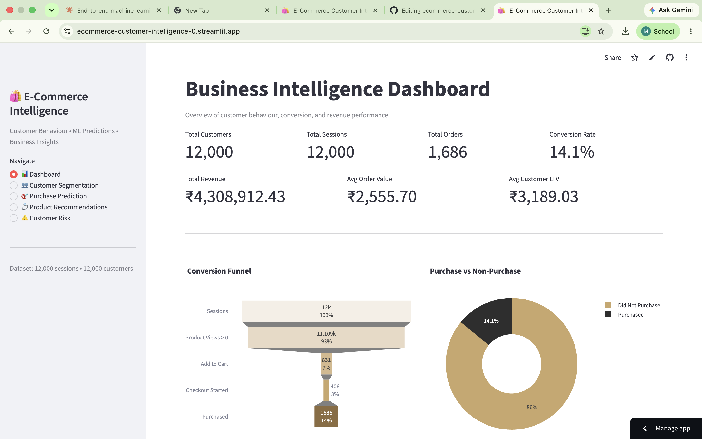
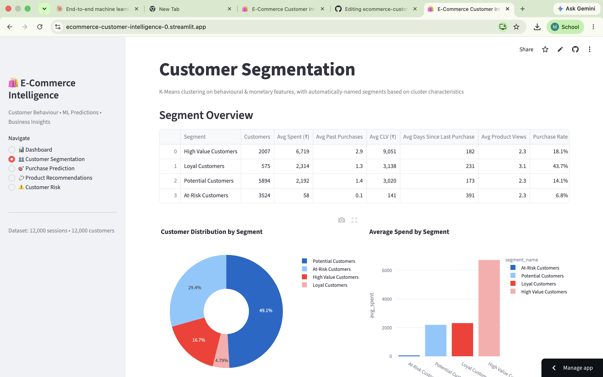
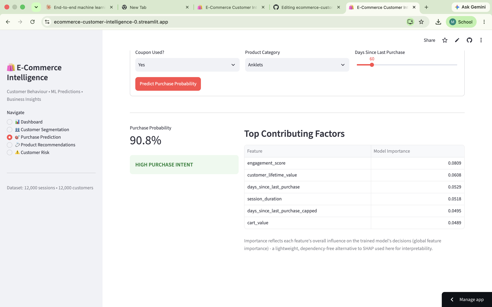
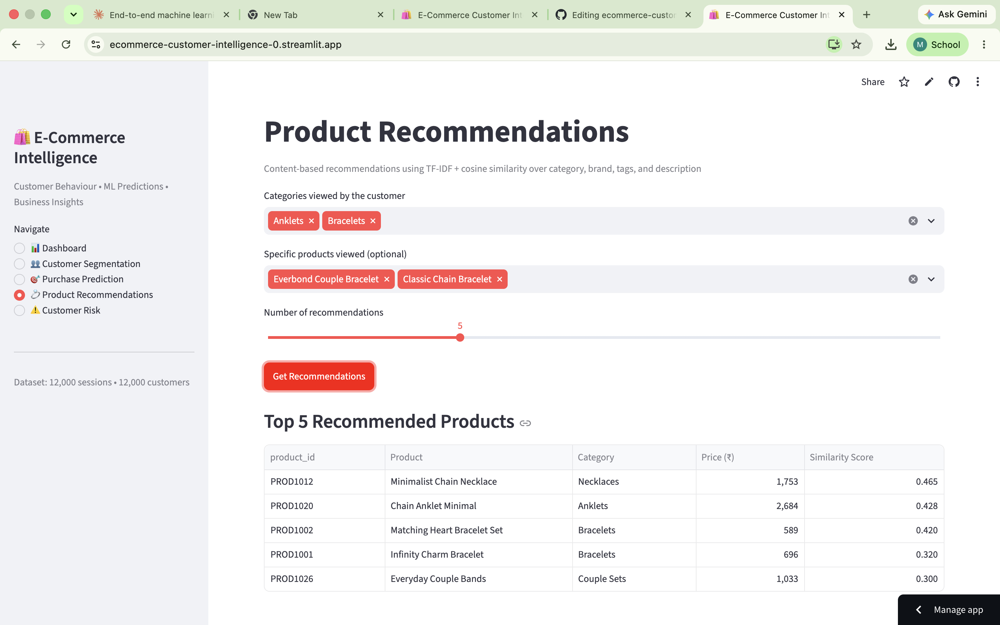
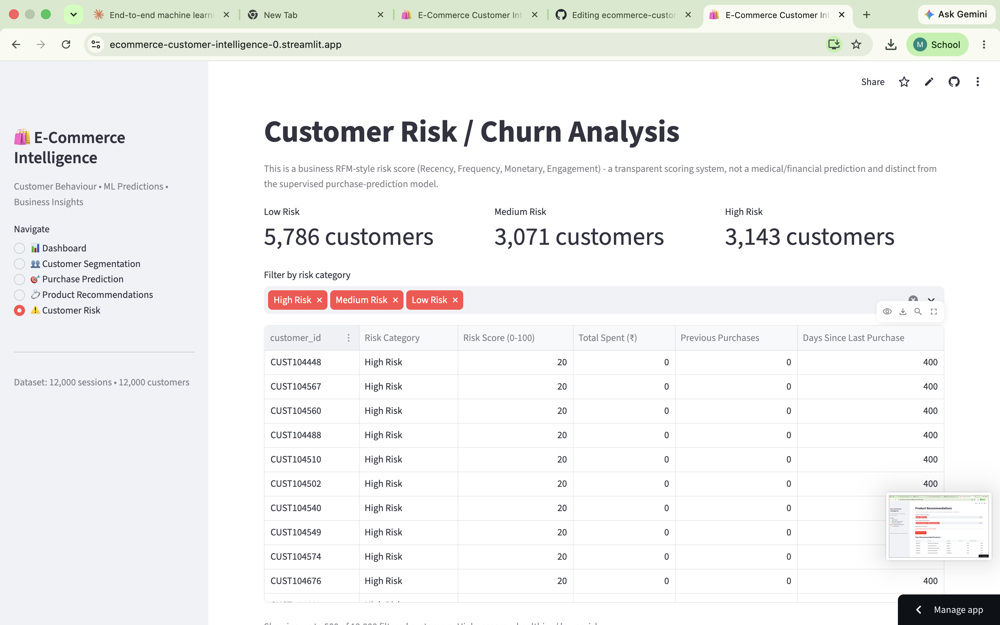

# E-Commerce Customer Intelligence & Purchase Prediction System

An end-to-end Data Science project that analyses e-commerce customer behaviour and
uses Machine Learning to segment customers, predict purchase probability, score
churn/risk, and recommend products — all through an interactive Streamlit
dashboard.

> **Note on the dataset:** the dataset used here (`data/ecommerce_customer_data.csv`)
> is **synthetically generated** by `generate_dataset.py`. It is not scraped from
> any real company. The generator builds in realistic behavioural relationships
> (more product views → higher purchase probability, checkout-started strongly
> predicts purchase, loyal customers convert more, etc.) plus genuine noise and
> class imbalance, so the trained models behave the way models on real
> e-commerce data would — including realistic (not artificially perfect)
> accuracy.

---

## 1. Features

- **Customer Segmentation** — K-Means clustering (with Elbow Method + Silhouette
  Score to pick K) that automatically names segments (High Value, Loyal,
  Potential, At-Risk) based on cluster characteristics, not hardcoded IDs.
- **Purchase Prediction** — Logistic Regression, Random Forest, and XGBoost
  compared on Accuracy, Precision, Recall, F1, ROC-AUC, and Confusion Matrix;
  best model selected automatically and served through an interactive form.
- **Customer Risk / Churn Scoring** — a transparent RFM-style (Recency,
  Frequency, Monetary, Engagement) business scoring system, distinct from the
  ML classifier.
- **Product Recommendations** — content-based recommender using TF-IDF +
  cosine similarity over a fictional jewelry product catalogue.
- **Business Intelligence Dashboard** — KPIs, conversion funnel, revenue
  trends, device/traffic/category performance, all built with Plotly.
- **SQLite Database Layer** — normalised schema (customers, sessions,
  products, transactions) written in portable SQL, structured so it can be
  migrated to MySQL later with minimal changes.

---

## 2. Architecture

```
DATASET
  ↓
DATA INGESTION  →  DATA CLEANING  →  EDA  →  FEATURE ENGINEERING
  ↓
  ├── Customer Segmentation (K-Means)
  ├── Purchase Prediction (Logistic Regression / Random Forest / XGBoost)
  ├── Churn / Risk Scoring (RFM)
  └── Product Recommendation (TF-IDF + Cosine Similarity)
  ↓
BUSINESS INSIGHTS  →  STREAMLIT DASHBOARD
```

---

## 3. Tech Stack

Python 3.11+, Pandas, NumPy, Scikit-learn, XGBoost, Matplotlib, Plotly,
Streamlit, SQLite, Joblib.

---

## 4. Project Structure

```
project/
├── app.py                     Streamlit dashboard (5 pages)
├── requirements.txt
├── README.md
├── generate_dataset.py        Synthetic dataset + product catalogue generator
├── train_models.py            Full model training pipeline
├── setup_database.py          DB schema creation + data loading
│
├── data/
│   ├── ecommerce_customer_data.csv
│   ├── products.csv
│   └── customer_segments.csv  (generated by train_models.py)
│
├── database/
│   └── ecommerce.db
│
├── models/
│   ├── purchase_prediction_model.pkl
│   ├── preprocessing_pipeline.pkl
│   ├── clustering_model.pkl
│   ├── cluster_scaler.pkl
│   ├── feature_list.json
│   └── metrics.json
│
├── src/
│   ├── utils.py
│   ├── data_preprocessing.py
│   ├── eda.py
│   ├── segmentation.py
│   ├── purchase_prediction.py
│   ├── churn_analysis.py
│   ├── recommendation.py
│   └── database.py
│
├── tests/
│   └── test_project.py
│
└── reports/
    ├── project_report.md
    ├── presentation_content.md
    └── viva_questions.md
```

---

## 5. Installation

```bash
python -m venv venv
```

Activate it:

```bash
# Windows
venv\Scripts\activate

# macOS / Linux
source venv/bin/activate
```

Install dependencies:

```bash
pip install -r requirements.txt
```

---

## 6. Running the Project

Run these in order (each step's output feeds the next):

```bash
# 1. Generate the synthetic dataset + product catalogue
python generate_dataset.py

# 2. Create and populate the SQLite database
python setup_database.py

# 3. Train and save the ML models (segmentation + purchase prediction)
python train_models.py

# 4. Launch the dashboard
streamlit run app.py
```

The dashboard opens at `http://localhost:8501`.

### Running tests

```bash
pytest tests/ -v
```

---

## 7. Expected Output

- `generate_dataset.py` prints the number of records generated and the
  purchase rate (~10-17%, intentionally imbalanced like real e-commerce data).
- `train_models.py` prints a comparison table of all three classifiers and
  which one was selected, plus the cluster segment sizes.
- `streamlit run app.py` opens a 5-page dashboard: Dashboard, Customer
  Segmentation, Purchase Prediction, Product Recommendations, Customer Risk.

---

## 8. Model Evaluation Summary

See `models/metrics.json` after training for exact numbers on your run
(a fixed random seed is used, so numbers should be close to):

| Model | Accuracy | Precision | Recall | F1 | ROC-AUC |
|---|---|---|---|---|---|
| Random Forest | ~0.78 | ~0.31 | ~0.45 | ~0.37 | ~0.72 |
| Logistic Regression | ~0.67 | ~0.24 | ~0.61 | ~0.34 | ~0.72 |
| XGBoost | ~0.76 | ~0.27 | ~0.43 | ~0.33 | ~0.69 |

The best model is selected by **ROC-AUC**, not accuracy, because `purchase`
is a minority class (~10-17% positive) — a model predicting "no purchase"
for everyone would score high accuracy while being useless. Precision/recall
are intentionally modest here: this reflects a genuinely noisy behavioural
signal rather than an inflated, unrealistic dataset.

---

## 9. Future Improvements

- Swap SQLite for MySQL in production (schema is already portable SQL).
- Add SHAP-based explainability once dependency versions stabilise for your
  environment (a lightweight feature-importance explainer is used as the
  default here).
- Add a collaborative-filtering recommender once real transaction/ratings
  data is available (current recommender is content-based only).
- Add scheduled retraining and model versioning.
- Add authentication if deployed for multiple business users.

---

## 10. Live Demo

🚀 **Try the deployed application:**

👉 https://ecommerce-customer-intelligence-0.streamlit.app/

The application provides an interactive interface for:
- Business Intelligence Dashboard
- Customer Segmentation
- Purchase Prediction
- Product Recommendations
- Customer Risk / Churn Analysis

---

## 11. Application Screenshots

### Business Intelligence Dashboard



### Customer Segmentation



### Purchase Prediction



### Product Recommendations



### Customer Risk / Churn Analysis



---

## 12. Key Business Insights

The system transforms raw e-commerce behavioural data into actionable business intelligence.

### Customer Segmentation
Identifies customer groups based on purchasing behaviour, engagement and value, helping businesses target different customer segments with appropriate strategies.

### Purchase Prediction
Machine learning models estimate the probability that a customer will complete a purchase based on behavioural signals such as product views, cart activity and checkout behaviour.

### Customer Risk Analysis
Customers are assigned High, Medium or Low risk scores using behavioural and RFM-style metrics, helping businesses identify customers who may require retention campaigns.

### Product Recommendations
A content-based recommendation engine uses TF-IDF and cosine similarity to recommend products based on customer interests and previously viewed products.

---

## 13. Project Highlights

- End-to-end Data Science pipeline
- Exploratory Data Analysis
- Feature Engineering
- K-Means Customer Segmentation
- Logistic Regression
- Random Forest
- XGBoost
- RFM-style Customer Risk Scoring
- TF-IDF Product Recommendation
- SQLite Database
- Interactive Plotly Visualisations
- Streamlit Dashboard
- Automated model selection using ROC-AUC
- Unit testing with PyTest

---

## 14. Author

**Mateen Akhtar**

B.Tech Computer Science & Engineering  
Data Science & Artificial Intelligence
